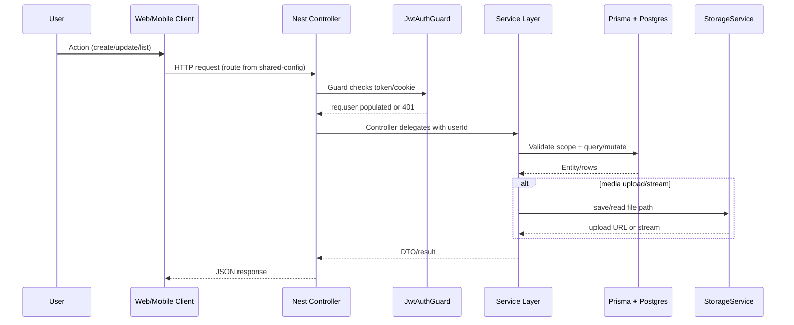

# Codebase Flow Diagram

```mermaid
flowchart LR
  subgraph Clients
    WB[Web App\nNext.js pages/components]
    MB[Mobile App\nReact Native]
  end

  subgraph Shared
    SC[@ideahome/shared-config\nroute builders + constants + shared types]
  end

  subgraph WebRuntime[Web Runtime (web)]
    WAPI[web/lib/api/*\nfetch helpers + auth headers]
    WRW[next.config rewrites\nroute forwarding rules]
    WSRV[Next API /api/[[...path]]\noptional built-in API bridge]
  end

  subgraph Backend[Backend (backend, NestJS)]
    MAIN[main.ts / serverless.ts\nNest bootstrap]
    GUARD[JwtAuthGuard\nJWT/Firebase/dev bypass]
    MODS[Domain Modules\nprojects/issues/todos/ideas/bugs/features/expenses/auth/users/orgs/tests]
    SRV[Services\nvalidation + org scope + business logic]
    PRISMA[PrismaService]
    STORE[StorageService\nuploads/screenshots/recordings/files]
  end

  subgraph Data
    PG[(PostgreSQL\nPrisma models)]
    FS[(Filesystem uploads)]
  end

  WB --> SC
  MB --> SC

  WB --> WAPI
  WAPI --> WRW
  WRW -->|USE_BUILTIN_API=false| MAIN
  WRW -->|USE_BUILTIN_API=true (/api)| WSRV
  WSRV --> MAIN

  MB -->|HTTPS + Bearer token| MAIN

  MAIN --> GUARD
  GUARD --> MODS
  MODS --> SRV
  SRV --> PRISMA
  PRISMA --> PG
  SRV --> STORE
  STORE --> FS

  SC -.path builders used by.-> WAPI
  SC -.path builders used by.-> MB

  classDef node fill:#f8fbff,stroke:#4b6b8a,color:#0f1f2e
  class WB,MB,SC,WAPI,WRW,WSRV,MAIN,GUARD,MODS,SRV,PRISMA,STORE,PG,FS node
```

## Key Runtime Flows



## Notes

- `web/lib/api/*` and `app/src/api/client.ts` both depend on `@ideahome/shared-config` path builders, keeping client/backend route contracts aligned.
- In web deployments, traffic is routed either directly to backend (`BACKEND_URL`) or through Next serverless API to `backend/serverless` when `USE_BUILTIN_API=true`.
- Auth is centralized in `JwtAuthGuard`, which supports JWT, Firebase token fallback, and explicit dev bypass flags.
- Domain services enforce organization/project scope before Prisma access.
- Binary/media content uses `StorageService` + filesystem paths while metadata lives in Postgres.
