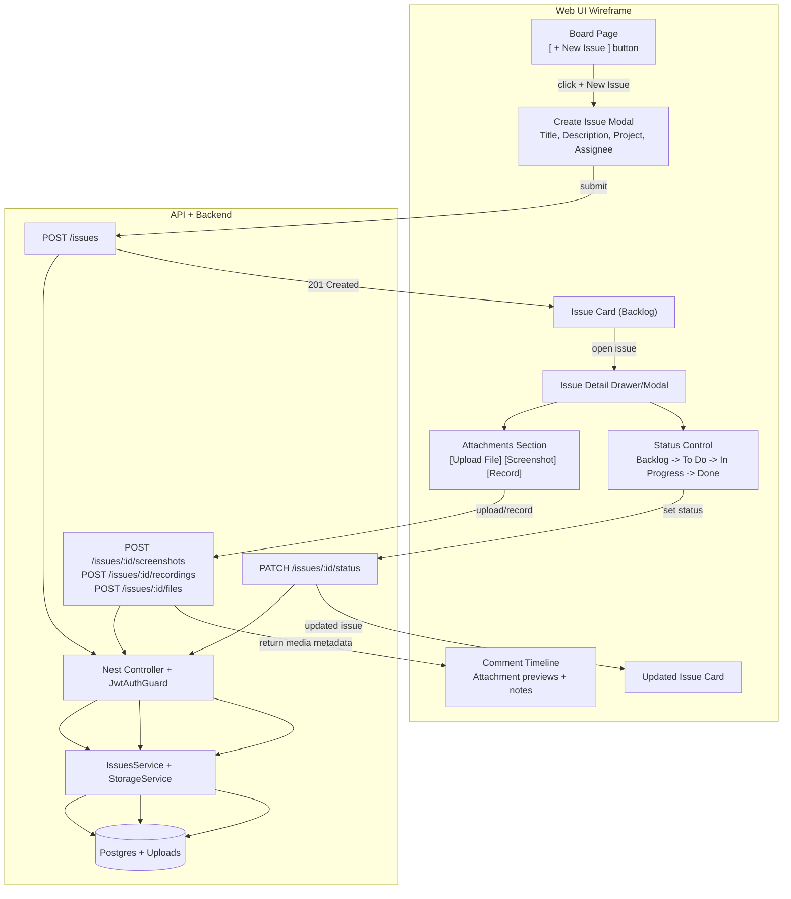
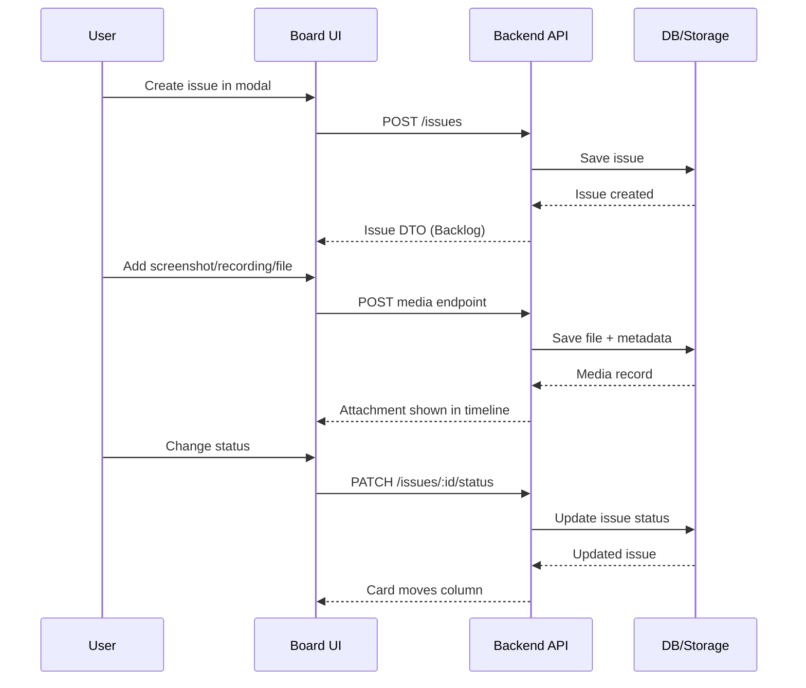

# Issue Flow Wireframe

## Create Issue -> Attach Media -> Move Status

```mermaid
flowchart TB
  subgraph UI["Web UI Wireframe"]
    A["Board Page<br/>[ + New Issue ] button"]
    B["Create Issue Modal<br/>Title, Description, Project, Assignee"]
    C["Issue Card (Backlog)"]
    D["Issue Detail Drawer/Modal"]
    E["Attachments Section<br/>[Upload File] [Screenshot] [Record]"]
    F["Status Control<br/>Backlog -> To Do -> In Progress -> Done"]
    G["Updated Issue Card"]
    H["Comment Timeline<br/>Attachment previews + notes"]
  end

  subgraph API["API + Backend"]
    I["POST /issues"]
    J["POST /issues/:id/screenshots<br/>POST /issues/:id/recordings<br/>POST /issues/:id/files"]
    K["PATCH /issues/:id/status"]
    L["Nest Controller + JwtAuthGuard"]
    M["IssuesService + StorageService"]
    N[("Postgres + Uploads")]
  end

  A -->|click + New Issue| B
  B -->|submit| I
  I --> L --> M --> N
  I -->|201 Created| C
  C -->|open issue| D
  D --> E
  E -->|upload/record| J
  J --> L --> M --> N
  J -->|return media metadata| H
  D --> F
  F -->|set status| K
  K --> L --> M --> N
  K -->|updated issue| G
```

## Quick Interaction Map

```mermaid
sequenceDiagram
  participant U as User
  participant UI as Board UI
  participant API as Backend API
  participant DB as DB/Storage

  U->>UI: Create issue in modal
  UI->>API: POST /issues
  API->>DB: Save issue
  DB-->>API: Issue created
  API-->>UI: Issue DTO (Backlog)

  U->>UI: Add screenshot/recording/file
  UI->>API: POST media endpoint
  API->>DB: Save file + metadata
  DB-->>API: Media record
  API-->>UI: Attachment shown in timeline

  U->>UI: Change status
  UI->>API: PATCH /issues/:id/status
  API->>DB: Update issue status
  DB-->>API: Updated issue
  API-->>UI: Card moves column
```
